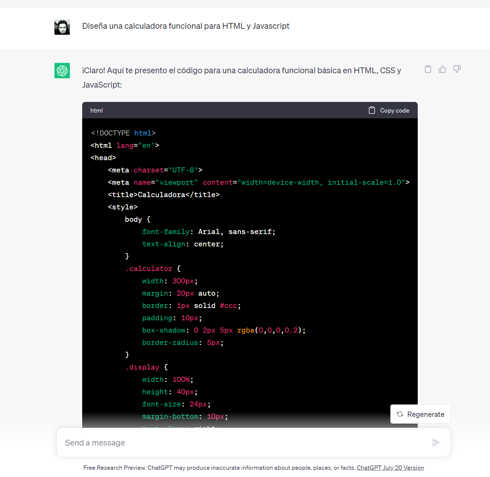

# Curso de CHAT GPT con Python del CIC-IPN

> **Centro de Investigación en Computación**
>
> *Instituto Politécnico Nacional*
>
> Departamento de Diplomados y Extensión Profesional
>


**Profesor**: [Alan Badillo Salas](alan@nomadacode.com)


---

## Bienvenida

¡Bienvenidos a la emocionante primera edición del curso de Introducción a Chat GPT con Python!

Este innovador curso está a la vanguardia internacional y es un auténtico pionero en México.

Aquí, adquirirás las bases sólidas de Chat GPT y aprenderás cómo aprovechar esta poderosa herramienta en diversos campos científicos y empresariales.

Prepárate para sumergirte en el fascinante mundo de la inteligencia artificial y descubrir todo el potencial que Chat GPT tiene para ofrecer. Nuestro equipo de expertos estará encantado de guiarte en cada paso del camino y asegurarse de que tengas una experiencia de aprendizaje enriquecedora.

¡Estamos emocionados de tenerte a bordo y explorar juntos las infinitas posibilidades que este curso tiene reservadas para ti! ¡Comencemos esta emocionante travesía hacia el conocimiento y la innovación!

Con ChatGPT, podrás:

1. **Conversar con la Inteligencia Artificial:** ¡Habla directamente con el modelo y recibe respuestas coherentes y contextualizadas! Descubre cómo esta herramienta puede mejorar la interacción hombre-máquina.

2. **Generar Textos Creativos:** ¿Quieres crear poesía, cuentos o incluso guiones de películas? ChatGPT te permite desatar tu creatividad y producir contenido único y original.

3. **Resolver Problemas de Negocio:** Aplica ChatGPT para ofrecer asistencia a tus clientes y responder preguntas en tiempo real. Impulsa tu servicio al cliente a nuevos niveles.

4. **Automatizar Tareas Específicas:** Entrena el modelo para realizar tareas como resumir textos, traducir idiomas y clasificar datos. Aumenta tu productividad con la inteligencia artificial.

5. **Crear Aplicaciones Web Interactivas:** Integra ChatGPT en tus aplicaciones web y proporciona experiencias interactivas y personalizadas a tus usuarios.

¡Y esto es solo el principio! La inteligencia artificial está transformando nuestro mundo y con ChatGPT, tú también puedes ser parte de esta revolución. No necesitas ser un experto para empezar; la comunidad de IA es acogedora y hay muchas herramientas y recursos disponibles para aprender.

¿Te sientes emocionado? ¡Entonces ven y sumérgete en el fascinante universo de la inteligencia artificial con ChatGPT! Explora las posibilidades, desafía tus límites y da rienda suelta a tu imaginación.

¡Prepárate para un emocionante viaje de descubrimiento y aprendizaje! ¡Únete a nosotros en esta emocionante aventura hacia el futuro de la inteligencia artificial!

## La breve historia de Alex y Chat-GPT

Había una vez un joven emprendedor llamado Alex, apasionado por la inteligencia artificial y su potencial para cambiar el mundo. Desde muy temprana edad, Alex soñaba con crear una empresa que revolucionara la forma en que las personas interactúan con la tecnología. Su objetivo era desarrollar una herramienta que pudiera comprender y responder a las preguntas de las personas de manera natural y coherente.

Un día, mientras investigaba sobre las últimas innovaciones en inteligencia artificial, Alex descubrió ChatGPT. Quedó maravillado por la capacidad del modelo para generar texto y tener conversaciones casi humanas. Se dio cuenta de que tenía en sus manos la oportunidad de hacer realidad su sueño.

Con determinación y entusiasmo, Alex se embarcó en un emocionante viaje para crear su empresa. Utilizó ChatGPT como base para desarrollar una interfaz de chat inteligente y fácil de usar. Su objetivo era hacer que esta herramienta fuera accesible para todos, incluso para aquellos que no tenían conocimientos técnicos en inteligencia artificial.

Después de meses de arduo trabajo y colaboración con un equipo talentoso, Alex lanzó su empresa: "IntelliChat". La plataforma fue un éxito instantáneo. Las personas se sintieron atraídas por la facilidad con la que podían interactuar con la inteligencia artificial y obtener respuestas precisas y comprensibles.

IntelliChat se convirtió rápidamente en una herramienta indispensable en diversos campos. Desde estudiantes que encontraron apoyo en sus investigaciones, hasta empresas que automatizaron sus procesos de atención al cliente, todos encontraron un valor excepcional en el servicio de Alex.

El nombre de Alex comenzó a extenderse por la comunidad empresarial y de tecnología. Recibió reconocimientos y premios por su innovación y por proporcionar una solución valiosa y accesible en el campo de la inteligencia artificial.

Con el tiempo, IntelliChat se convirtió en una empresa exitosa y en un líder en la industria de inteligencia artificial. Alex siguió expandiendo su equipo y su visión. La empresa creció exponencialmente y sus productos se utilizaron en todo el mundo.

Pero a pesar de su éxito, Alex nunca olvidó su pasión por la inteligencia artificial y su deseo de hacer del mundo un lugar mejor a través de la tecnología. Continuó investigando y desarrollando nuevas formas de utilizar la IA para abordar problemas globales.

Y así, el cuento de Alex, el emprendedor de inteligencia artificial que usó ChatGPT para iniciar una empresa exitosa, sigue siendo contado por generaciones futuras. Su legado vive a través de las soluciones innovadoras que ha brindado al mundo y su determinación para marcar la diferencia con la tecnología que ama.

## Diseño de una Calculadora funcional para HTML y Javascript



¡Claro! Aquí te presento el código para una calculadora funcional básica en HTML, CSS y JavaScript:

```html
<!DOCTYPE html>
<html lang="en">
<head>
    <meta charset="UTF-8">
    <meta name="viewport" content="width=device-width, initial-scale=1.0">
    <title>Calculadora</title>
    <style>
        body {
            font-family: Arial, sans-serif;
            text-align: center;
        }
        .calculator {
            width: 300px;
            margin: 20px auto;
            border: 1px solid #ccc;
            padding: 10px;
            box-shadow: 0 2px 5px rgba(0,0,0,0.2);
            border-radius: 5px;
        }
        .display {
            width: 100%;
            height: 40px;
            font-size: 24px;
            margin-bottom: 10px;
            text-align: right;
            padding-right: 10px;
        }
        button {
            width: 70px;
            height: 50px;
            font-size: 20px;
            margin: 5px;
            cursor: pointer;
        }
        .equals {
            grid-column: span 2;
        }
    </style>
</head>
<body>
    <div class="calculator">
        <div class="display" id="display"></div>
        <button onclick="clearDisplay()">C</button>
        <button onclick="appendSymbol('/')">/</button>
        <button onclick="appendSymbol('*')">*</button>
        <button onclick="appendSymbol('7')">7</button>
        <button onclick="appendSymbol('8')">8</button>
        <button onclick="appendSymbol('9')">9</button>
        <button onclick="appendSymbol('-')">-</button>
        <button onclick="appendSymbol('4')">4</button>
        <button onclick="appendSymbol('5')">5</button>
        <button onclick="appendSymbol('6')">6</button>
        <button onclick="appendSymbol('+')">+</button>
        <button onclick="appendSymbol('1')">1</button>
        <button onclick="appendSymbol('2')">2</button>
        <button onclick="appendSymbol('3')">3</button>
        <button class="equals" onclick="calculate()">=</button>
        <button onclick="appendSymbol('0')">0</button>
        <button onclick="appendSymbol('.')">.</button>
    </div>

    <script>
        const display = document.getElementById('display');
        let expression = '';

        function clearDisplay() {
            expression = '';
            updateDisplay();
        }

        function appendSymbol(symbol) {
            expression += symbol;
            updateDisplay();
        }

        function calculate() {
            try {
                const result = eval(expression);
                expression = String(result);
                updateDisplay();
            } catch (error) {
                expression = 'Error';
                updateDisplay();
            }
        }

        function updateDisplay() {
            display.textContent = expression;
        }
    </script>
</body>
</html>
```

Este código crea una calculadora simple con botones para los dígitos del 0 al 9, operadores básicos (+, -, *, /) y el botón de igual (=) para calcular el resultado. El resultado se mostrará en la parte superior de la calculadora. Puedes copiar y pegar este código en un archivo HTML para probar la calculadora en tu navegador.

Ten en cuenta que esta calculadora es básica y no incluye características avanzadas o validaciones de entrada. Puedes mejorarla agregando más funcionalidades y validaciones según tus necesidades. ¡Diviértete experimentando y mejorando la calculadora!

> Resultado:


