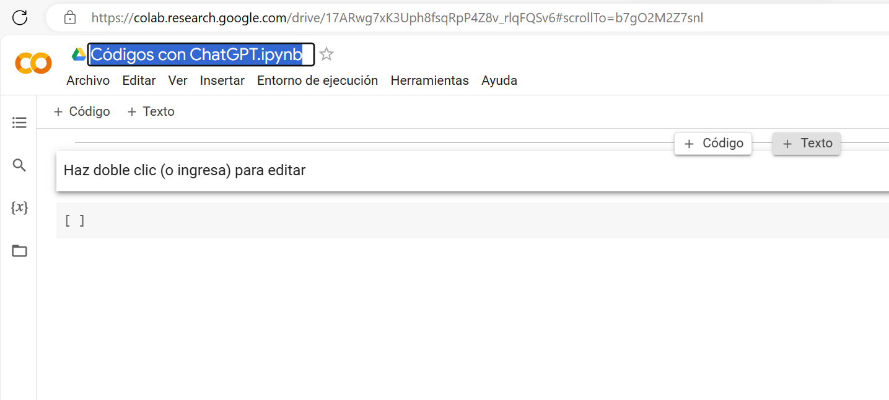
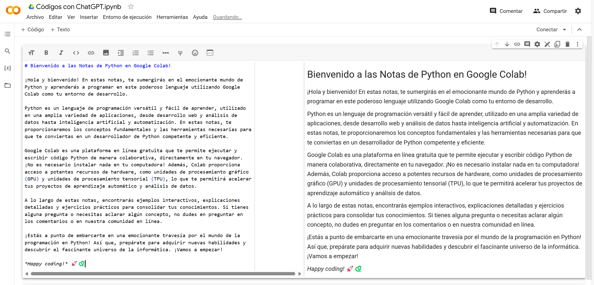
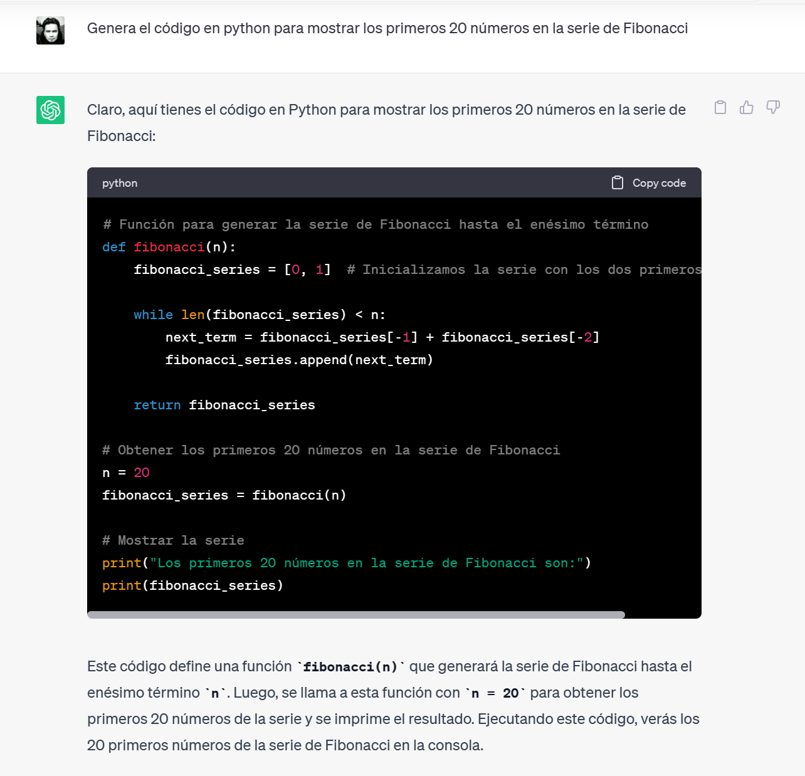
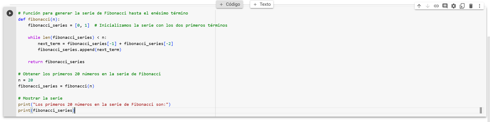
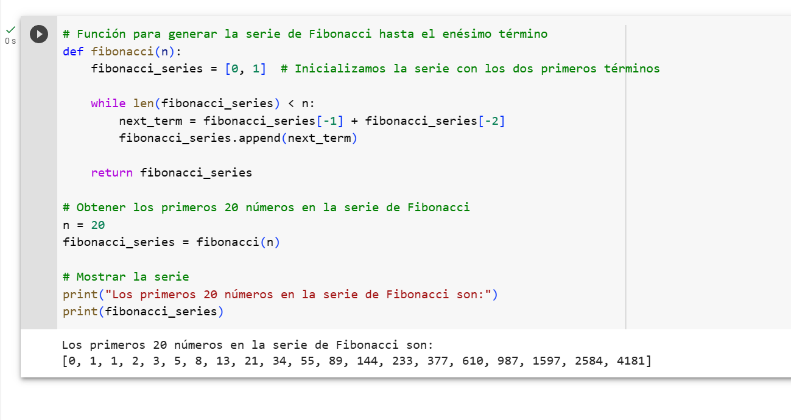
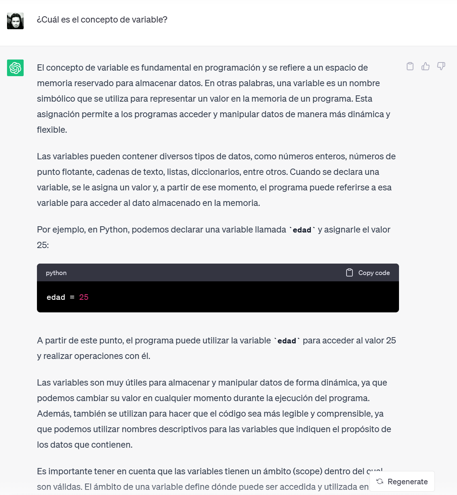
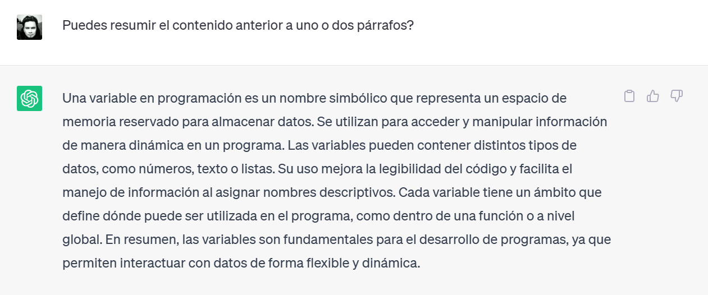
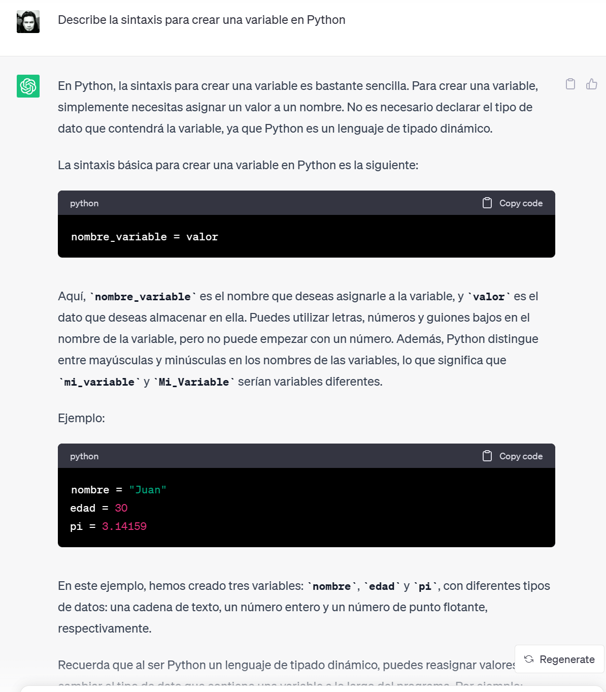
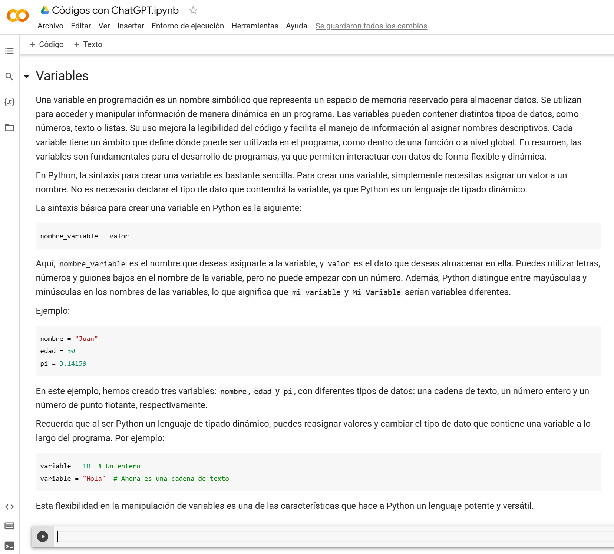
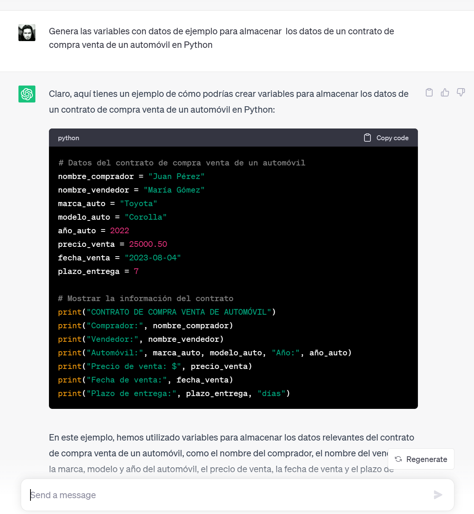

# Clase 102 - Introducción a Python para aplicaciones Científicas

> **Centro de Investigación en Computación**
>
> *Instituto Politécnico Nacional*
>
> Departamento de Diplomados y Extensión Profesional
>

**Profesor**: [Alan Badillo Salas](alan@nomadacode.com)

---

## Contenido

    - Variables y funciones
    - Datos, textos y archivos de texto
    - Colecciones y estructuras de control

## Objetivos

Aprender a utilizar a CHATGPT como un asistente de programación. Entender el uso de variables, funciones, transformación y filtrado de datos, y la utilización de diversas librerías de python como Pandas y Numpy a través de CHATGPT. Generar un código en pasos para resolver una tarea. Describir un código en pasos y hacerle modificaciones.

## Ejecutar códigos de Python

Para ejecutar códigos de Python podemos utilizar **Google Colab** (preguntar a ChatGPT qué es en breve), la cuál es una plataforma para  crear notas de texto (usando Markdown) y código de Python, que se puede ejecutar directamente ahí.

Basta iniciar sesión con una cuenta de Google (usa un navegador en modo privado para no dejar abierta tu sesión en clase).

> Página inicial de Google Colab

Crea una nueva Notebook interactiva y crea una celda de texto.

> Edita el nombre de la libreta y crea una celda de texto.

Solicita a CHATGPT que te genere un texto de bienvenida a **Las Notas de Python** en formato `MARKDOWN`.

> Copia las notas que generó CHATGPT en en la celda de texto de tus notas (pulsa el botón copiar a lado del texto generado)

Pega el texto generado en tus notas.

> Pulsa doble clic en la celda de texto y pega lo copiado desde CHATGPT (observa que está en formato de markdown porque el título usa `# Bienvenido...`)

Solicita a CHATGPT que genere el código en Python para mostrar los primeros 20 números de la serie de Fibonacci.

> Copia el código de CHATGPT en el panel que muestra el código (`Copy Code`)

Pega el código en una celda de código en Google Colab

> Crea una celda de código (trae el botón de ejecutar) y pega el código generado por CHATGPT

Ejecuta la celda y observa los resultados en tu libreta de Python

> Pulsa el botón de ejecutar o `CTRL+ENTER`

¡Listo! Ahora puedes solicitarle cualquier código a CHATGPT y probarlo en tu libreta.

Las funciones y variables ejecutadas en una celda estarán disponibles para las próximas celdas, por lo que puedes ir construyendo el código paso a paso mediante CHATGPT.

## Uso de Variables en Python

Vamos a solicitarle a CHATGPT que nos defina el concepto de variable en programación.

> Debería explicar que es similar a tener una etiqueta que apunta a una memoria para guardar valores de diferentes tipos, como números, textos, valores lógicos, etc.

Solicita a CHATGPT que resuma esa información que previamente estudiaste y pégala en una celda de texto en tu libreta.

Vamos a solicitarle a CHATGPT que nos describa la sintaxis de una variable y el resultado lo pegaremos en una celda de texto en nuestra libreta.

> Concepto de variable

> Concepto de variable resumido

> Sintaxis de una variable en Python

> Resultado en las notas de Colab

### Ejercicios de Variables

    NOTA: Copia los códigos resultantes en tu libreta en una celda de código,  y el texto que describe el código en una celda de texto. Ejecuta los resultados.

> Solicita a CHATGPT que genere las variables con valores de ejemplo para almacenar los datos de un contrato de compra venta de un automóvil

> Solicita a CHATGPT que genere las variables con valores de ejemplo para almacenar los datos de un producto para una tienda que vende frutas.
>
> Solicita a CHATGPT que genere el código para leer la variable peso y estatura desde el usuario usando una libreta de Jupyter
>
> Solicita a CHATGPT que genere el código para calcular el índice de masa corporal usando las variables anteriores
>

## Uso de Funciones

Las funciones de Python sirven para abstraer tareas basadas en argumentos o parámetros de entrada y en una salida opcional conocida como el resultado de la función.

Vamos a repetir el procedimiento para documentar en tu libreta el manejo de funciones siguiendo estos puntos:

1. Solicita a CHATGPT que describa qué es una función de Python y estudia los resultados
2. Solicita a CHATGPT que resuma la información y pégala en tu libreta
3. Solicita a CHATGPT que te muestre ejemplos del uso de funciones y pégalos en tu libreta

### Ejercicios de Funciones

> Solicita a CHATGPT que genere una función para devolver la suma de dos números con ejemplos de uso
>
> Solicita a CHATGPT que genere una función para devolver el mayor entre dos números con ejemplos de uso
>
> Solicita a CHATGPT que genere una función para devolver los elementos mínimo y máximo de una lista de números con ejemplos de uso
>
> Solicita a CHATGPT que genere una función para ordenar una lista de números con ejemplos de uso
>
> Solicita a CHATGPT que genere una función que descargue un archivo PDF de una URL con ejemplos de uso
>
> Solicita a CHATGPT que genere una función que reciba una lista de números y los guarde en un archivo de texto con ejemplos de uso
>
> Solicita a CHATGPT que genere una función que reciba el nombre de un archivo que contiene una lista de números, que recupere la lista de números desde el archivo y que la devuelva con ejemplos de uso.
>
> Solicita a CHATGPT que genere una función que cree un diccionario con valores aleatorios de una persona usando una lista de nombres y una lista de apellidos y que contemple la edad, el peso, el sexo, si está casado, si trabaja, etc. Y que devuelva el diccionario con ejemplos de uso
>
> Solicita a CHATGPT que genere una función que lea una imagen de una ruta local y la escale a 200x200 pixeles y la guarde en la misma ruta pero con el sufijo 200x200.png con ejemplos de uso
>
> Solicita a CHATGPT que genere una función que recupere el texto de un documento PDF leído desde la ruta local con ejemplos de uso

## Uso de Listas en Python

Las listas de Python son similares a las variables, con la diferencia que permiten almacenar colecciones de datos, como múltiples valores, por ejemplo, para almacenar una lista de calificaciones, una lista de edades, una lista de medidas de tornillos, una lista de nombres, etc.

Vamos a repetir el procedimiento para documentar en tu libreta el manejo de listas siguiendo estos puntos:

1. Solicita a CHATGPT que describa qué es una lista de Python y estudia los resultados
2. Solicita a CHATGPT que resuma la información y pégala en tu libreta
3. Solicita a CHATGPT que te muestre ejemplos del uso de listas y pégalos en tu libreta

### Ejercicios de listas

    NOTA: Pega los resultados en tu libreta

> Solicita a CHATGPT que genere el código en Python para una lista de calificaciones entre 0 y 10 con valores cercanos a 8.5
>
> Solicita a CHATGPT que genere el código para calcular el promedio de la lista anterior
>
> Solicita a CHATGPT que genere el código para calcular la desviación estándar de la lista anterior
>
> Solicita a CHATGPT que te explique qué es la desviación estándar y sus aplicaciones
>
> Solicita a CHATGPT que te explique cómo determinar un intervalo de confianza usando la desviación estándar
>
> Solicita a CHATGPT que genere el código para calcular el intervalo de confianza al 95% para la lista de calificaciones
>
> Repite el experimento para una lista de medidas de tornillos cuya media es 1.5 y desviación estándar 0.03
>
> Solicita a CHATGPT que genere una lista de nombres aleatorios en python
>
> Solicita a CHATGPT que genere una lista de apellidos aleatorios en python
>
> Solicita a CHATGPT que genere el código para seleccionar un nombre y dos apellidos de forma aleatoria de las listas anteriores e imprimirlo en la pantalla
>
> Solicita a CHATGPT que mejore la impresión del nombre generado usando el formato APELLIDO_1 APELLIDO_2, NOMBRE
>
> Solicita a CHATGPT que genere una lista de puntos con coordenada x, y con valores aleatorios en un círculo unitario
>
> Solicita a CHATGPT que genere el código para imprimir los puntos en formato de tabla estilo markdown
>
> Solicita a CHATGPT que genere el código para imprimir los puntos en formado CSV
>

## Archivos de Texto

En Python podemos leer y escribir archivos de texto que contengan información como notas periodísticas, valores de un censo poblacional, mensajes de reseñas o de un chat, imágenes, vídeo y demás.

Vamos a repetir el procedimiento para documentar en tu libreta el manejo de archivos siguiendo estos puntos:

1. Solicita a CHATGPT que describa cómo leer y escribir una archivo de texto en Python y estudia los resultados
2. Solicita a CHATGPT que resuma la información y pégala en tu libreta
3. Solicita a CHATGPT que te muestre ejemplos del uso de lectura y escritura de archivos y pégalos en tu libreta

### Ejercicios de Archivos

> Solicita a CHATGPT que genere el código para escribir un archivo de texto que guarde una lista de puntos
>
> Solicita a CHATGPT que genere el código para escribir un archivo HTML con una lista de puntos transformada en formato HTML
>
> Solicita a CHATGPT que genere el código para escribir un archivo JSON con una lista de puntos transformada en formato JSON
>
> Solicita a CHATGPT que genere el código para escribir un archivo CSV con una lista de puntos transformada en formato CSV
>
> Solicita a CHATGPT que genere el código para escribir un archivo de Excel con una lista de puntos transformados a una hoja de Excel
>
> Solicita a CHATGPT que genere el código para recuperar una lista de puntos guardada en un archivo de texto
>
> Solicita a CHATGPT que genere el código para recuperar una lista de puntos guardada en un archivo JSON
>
> Solicita a CHATGPT que genere el código para recuperar una lista de puntos guardada en un archivo CSV
>
> Solicita a CHATGPT que genere el código para recuperar una lista de puntos guardada en una hoja de Excel
>
> Solicita a CHATGPT que genere el código para crear un archivo PDF que inserte un título, un subtítulo, un párrafo de texto y una imagen
>
> Solicita a CHATGPT que genere el código para generar una gráfica de barras a partir de una lista de calificaciones y la guarde en un archivo de imagen PNG
>
> Solicita a CHATGPT que genere el código para recuperar el audio desde un archivo MP3 y extraíga los valores del segundo 3 al segundo 4
>
> Solicita a CHATGPT que genere el código para recuperar el frame 128 de un video desde un archivo MP4 y guarde el frame en un un archivo de imagen PNG
>