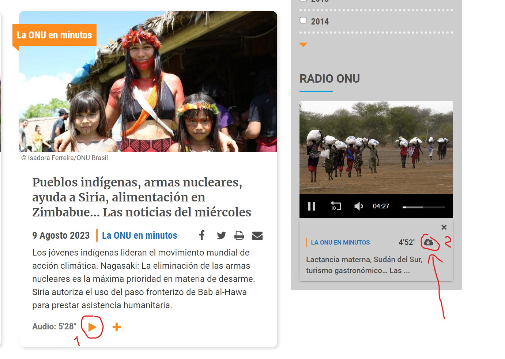
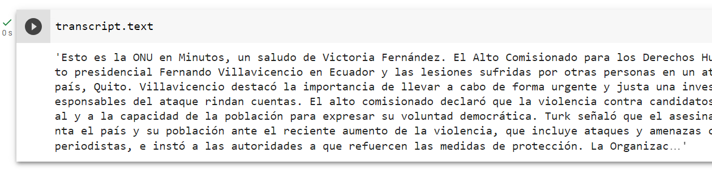
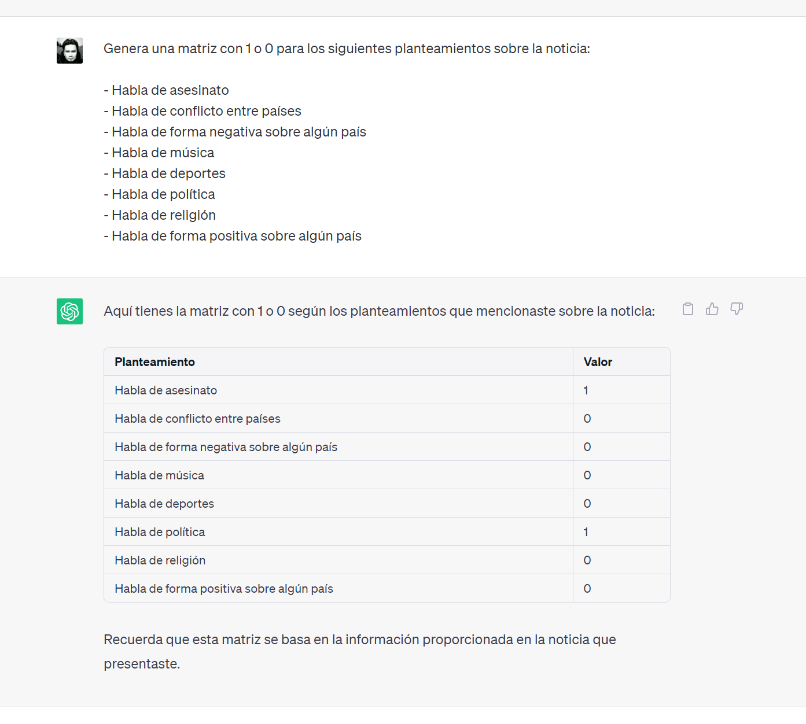

# Clase 103 - Prácticas

> **Centro de Investigación en Computación**
>
> *Instituto Politécnico Nacional*
>
> Departamento de Diplomados y Extensión Profesional
>


**Profesor**: [Alan Badillo Salas](alan@nomadacode.com)

---

## Introducción

Las siguientes prácticas tienen el objetivo de refozar el uso de la herramienta CHATGPT y sus aplicaciones en el ámbito Científico, Empresarial y Personal.

Crea un documento de texto con los resultados de cada ejercicio de solicitud a CHATGPT o diseños solicitados con capturas de pantalla de los resultados.

Adicionalmente prueba los códigos generados bajo el lenguaje de Python, usando Google Colab. **NOTA:** Los archivos generados en Google Colab se encuentran en la parte izquierda en el ícono de folder que dice `Archivos`.

## Instrucciones

> **LEE CUIDADOSAMENTE LAS SIGUIENTES INSTRUCCIONES**

El documento debe cumplir los siguientes requisitos:

1. Tener una portada con el nombre y logos del instituto (Instituto Politécnico Nacional y Centro de Investigación en Computación).
2. La portada debe contener el nombre del alumno (tu nombre completo) y opcionalmente el correo (público sólo si lo deseas y con fines de ser contactado en el futuro, será expuesto de forma pública en Github).
3. El nombre completo del curso (Introducción a CHATGPT con Python).
4. El nombre de la práctica (**Práctica 103**).
5. El nombre del profesor a cargo del curso (Alan Badillo Salas).
6. El mes y año (Agosto 2023).
7. Una introducción al uso de CHATGPT (por ejemplo, "CHATGPT es una herramienta que permite...").
8. Una justificación al uso de CHATGPT (a modo de motivación, por ejemplo, "La necesidad de usar herramientas de inteligencia artificial nos lleva a buscar soluciones como CHATGPT...")
9. El desarrollo de cada cada ejercicio en 2 etapas: **Definición** y **Resultados**, por ejemplo, el enunciado de cada ejercicio (por ejemplo, "Solicita a CHATGPT que redacte un correo...") y los resultados (captura de pantalla o el texto/código de respuesta).
10. Las conclusiones percibidas sobre esta práctica (por ejemplo, lo que aprendiste, los resultados esperados previos, los resultados obtenidos, el contraste entre los esperado y lo obtenido, si cumplió las expectativas para resolver cierto problema o si no las cumplió, el tipo de beneficios que puede aportarle a la humanidad, las ventajas y desventajas, etc.) **Nota:** Este será el criterio principal de evaluación.

Se debe entregar un sólo documento para toda esta serie de ejercicios bajo los siguientes aspectos:

1. El documento debe estar en formato PDF y no debe pesar más de 20 MB.
2. Todos los ejercicios de está práctica (**Práctica 103**) deben estar en el documento.
3. Las capturas de pantalla deben ser legibles (puedes recortarla en varias partes si abarca múltiples hojas). **Nota:** puedes usar *WIN+SHIFT+S* para recortar una región específica de la pantalla y pegarla en Word directamente.
4. Todo el resultado producido por CHATGPT debe estar contenido (no omitas partes de la respuesta por ahorrar espacio).
5. El archivo debe llamarse: `P103-TU-NOMBRE-COMPLETO-EN-MAYUSCULAS-SIN-ACENTOS-Y-SIN-ESPACIOS.pdf` (usando tu nombre completo sin acentos y sin espacios).

Deberás entregar la práctica al correo del profesor ([dragonnomada123@gmail.com](dragonnomada123@gmail.com)) con el sujeto: `CURSO CHATGPT - P103 TU-NOMBRE-CORTO`.

La fecha de entrega será en clase y a más tardar antes de la clase de la próxima semana. Se evaluarán 5 de las 7 prácticas y su promedio será tu calificación final, para obtener el certificado emitido por el instituto.

¡Que tengas buena práctica! 😊

---

## P103.1 - Transcripción de Audio a Texto

> .1 Solicita a CHATGPT que genere una aplicación de HTML y Javascript que grabe un audio desde el micrófono y un botón para descargar el audio. 
>

```text
Crea una aplicación de HTML con Javascript que permita grabar audio desde el micrófono y un botón para descargar el audio
```

> .2 Copia el código HTML en un archivo `index.html` y ejecútalo en un navegador.
>

**IMPORTANTE** No olvides aceptar el permiso para grabar desde el micrófono.

> .3 Graba algo interesante y descarga el audio. 
>

**NOTA:** Para esta práctica necesitarás una computadora con micrófono, si no la tienes en lugar de grabar un audio, prueba descargar el audio de ejemplo [https://raw.githubusercontent.com/dragonnomada/chat-gpt-2023/main/datasets/grabacion_audio.wav](https://raw.githubusercontent.com/dragonnomada/chat-gpt-2023/main/datasets/grabacion_audio.wav) para probar que funcione. Si deseas grabar tu propio audio consigue una computadora con micrófono. 

> .4 Carga el audio en Google Colab y coloca las siguientes celdas:
>

```python
!pip install openai
```

```python
import openai

# Configura tu clave de API de OpenAI
openai.api_key = "TU_API_KEY"
```

```python
audio_file= open("/content/grabacion_audio.wav", "rb")
transcript = openai.Audio.transcribe("whisper-1", audio_file)

print(transcript.text)
```

## P103.2 - Análisis de Texto

> .1 Genera el audio para una noticia ficticia que hable de alguna persona famosa previa a septiembre del 2021, por ejemplo, algo sobre Katy Perry o Maluma. Procura que en la noticia contenga fechas, correos o datos interesantes que después quieras extraer. 
>

**NOTA:** Alternativamente si no puedes grabar el audio, busca una noticia en mp3 en [https://news.un.org/es/audio-hub](https://news.un.org/es/audio-hub) o pudedes descargar la noticia de ejemplo desde [https://raw.githubusercontent.com/dragonnomada/chat-gpt-2023/main/datasets/noticia.mp3](https://raw.githubusercontent.com/dragonnomada/chat-gpt-2023/main/datasets/noticia.mp3)




> .2 Obtén la transcripción de la noticia usando `openai.Audio.transcribe("whisper-1", audio_file)`
> 



> .3 Utiliza el API de CHATGPT para Python para obtener una extraer información de la noticia, considera los siguientes puntos:

* `Genera un análisis de la noticia`
* `¿De qué habla la noticia?`
* `¿Qué personas y organizaciones aparecen en la noticia?`
* `¿De cuándo habla la noticia?`
* `¿Hablan de un asesinato en la noticia?`
* `¿Hablan de algún país en la noticia?`
* `¿Hablan de música en la noticia?`
* `¿Cuáles son las palabras principales de la noticia?`
* `Traduce la noticia al inglés`
* `Genera 10 puntos relevantes de la noticia`
* `Lista en una tabla las personas y organizaciones involucradas en la noticia y una breve descripción de la mención que se les hace`

## P103.3 - Caso de Estudio

> .1 Diseña un caso de estudio diferente al de las noticias para aplicar el reconocimiento de texto en un audio y el tipo de análisis del texto extraído.
>
> .2 Lista las preguntas que se le realizarían a CHATGPT para extraer la información
>
> .3 Genera una matriz de análisis donde indetifiques con 1 o 0 si se cumple la hipótesis planteada, por ejemplo, en el caso de la noticia:
>



> .4 Explica los planteamientos propuestos para tu matriz, es decir, el objetivo de tener el valor de 1 o 0 para diversos audios de la misma naturaleza, 
>
> Por ejemplo, si tu caso de estudio fueran noticias: **Podríamos crear un clasificador de noticias sobre política, deportes, religión, etc. Y análisis más profundos como todas las noticias que hablen de asesinatos.**